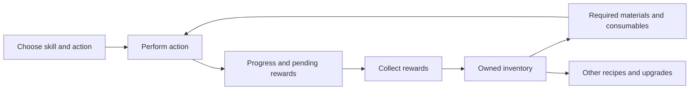

# How Ironwood RPG works

Ironwood RPG is the game; Ironwood Status is this repository's companion userscript. This reference explains the gameplay relationships needed to understand the companion and design useful features. For canonical term definitions, use the [glossary](../../CONTEXT.md); for the companion's behavior, use the [project walkthrough](../project-overview.md).

Reviewed on **26 September 2026**. The [source notes](ironwood-sources.md) record first-party descriptions and historical changes. Links to local source below identify the game's behavior **as represented by the current integration**, not an independent verification of the live game's complete rules. Exact costs, unlocks, rates, caps and reset times should be checked in the native game before relying on them.

## The main loop

Ironwood combines skill levelling, equipment improvement, rare loot and pet progression. Multiplayer adds a player market and guilds. Single-player uses a separate character and leaderboard without those two systems, so a guild panel is not a universal gameplay requirement. These mode boundaries come from the [developer's single-player announcement](https://www.reddit.com/r/PBBG/comments/1qbrmr9/ironwood_rpg_singleplayer_mode_release_date/); see the [source notes](ironwood-sources.md#core-play-and-game-modes) for later corroboration.

The player chooses a skill and a specific action within it: a resource to gather, an item to craft or an enemy to fight. That choice matters at both levels. Mining alone does not identify which resource is being gathered, and an enemy alone does not identify which combat skill is being trained. The companion models one current main action, with separate progress for House production, Taming expeditions and Attunement. See [action capture](../../src/integrations/ironwood/dom-reader.js) and [action identity](../../src/apps/quick-skills/service.js).

The useful resource model is:

This diagram describes resource flow, not a promise that every skill has identical controls. Finite crafting has a quantity to finish; gathering and combat have their own continuation conditions. Collecting current-action loot and successfully starting or resuming an action are separate outcomes. See [native controls](../../src/integrations/ironwood/native-controls.js) and [collection behavior](../user/automations.md#collection-recaps).

## Skills and regions

The current integration recognizes 17 skills: six Gathering, six Crafting, four Combat and Taming. It uses the following regional groups for challenges and traits. Defense appears in each region's reward group; Taming has its own expedition and pet systems. These groups are not a map of every enemy location. See the [skill groups](../../src/core/constants.js) and [skill roster](../../src/apps/quick-skills/service.js).

| Region | Gathering | Crafting | Combat reward skills |
| --- | --- | --- | --- |
| Forest | Woodcutting, Farming, Exploring | Alchemy | Ranged, Defense |
| Mountain | Mining, Delving | Smelting, Smithing | One-handed, Defense |
| Ocean | Fishing | Enchanting, Cooking, Imbuing | Two-handed, Defense |

Gathering supplies resources; crafting consumes materials to make other items; combat introduces enemy encounters and survival requirements. These families also matter to guild events: a Gathering event and a Crafting event apply to different sets of current actions. A skill's region, its family and its specific action are therefore three different attributes. See [guild skill matching](../../src/apps/guild/service.js).

## Progression beyond skill levels

Several systems turn the output of play into lasting improvements:

| System | Resource relationship | Result |
| --- | --- | --- |
| Traits | Delving gathers Crystals; Imbuing uses Crystals and Metal Parts to make Sigils | Sigils unlock and level permanent passive bonuses. |
| Skill Mastery | Meet a skill's XP, coin and item requirements | Gain a badge and a Mastery Point to spend on passive effects. |
| Marks | Find and claim rare skill collectibles | Unlock character bonuses. |
| Relics | Restore regional artifacts, then spend Quest Points on modifiers | Imprint modifiers onto the Relic to enhance the character. |

Sources: developer introductions of [Delving, Imbuing and Traits](https://www.reddit.com/r/IronwoodRPG/comments/1kyry2l/ironwood_rpg_delving_imbuing_traits_v135/), [Skill Mastery](https://www.reddit.com/r/IronwoodRPG/comments/1gzb2kq/ironwood_rpg_skill_mastery_v126/), [Marks](https://www.reddit.com/r/IronwoodRPG/comments/1fvw581/) and [Relics](https://www.reddit.com/r/IronwoodRPG/comments/1hr15lh/). These explain each system's purpose; current costs and bonus values need native confirmation.

Efficiency also matters when interpreting production: it can repeat an action, increasing XP and output while consuming additional materials where required. An action count is therefore not always an item count. See the [developer's efficiency explanation](https://www.reddit.com/r/IronwoodRPG/comments/13aoirp/).

## Four quantities that must stay separate

| Quantity | Meaning | Example |
| --- | --- | --- |
| Owned inventory | Items already held by the character | Materials available for another recipe |
| Pending loot | Rewards earned by an activity but still awaiting collection | Items shown under Current Loot |
| Remaining queue | Work still to be performed in a finite batch | Crafts left before production ends |
| Equipped consumables | Supplies equipped for use | Equipped potions, separate from stored reserves |

For a hypothetical batch of 100 crafts with 30 completed, the remaining work is 70 crafts. That does not establish that there are exactly 30 output items to collect: the recipe's output quantity, bonuses and any earlier collections matter. Likewise, stored potions do not prove that potions are equipped. See [inventory handling](../../src/apps/inventory/service.js), [finite-queue capture](../../src/integrations/ironwood/dom-reader.js) and [House projections](../../src/apps/automations/projections.js).

## Combat and recovery

Combat has player and enemy health, attacks, healing and defeat. Enemy respawn and player revival are different transitions: a new encounter can have the same enemy name and artwork, whereas revival describes the player's recovery after defeat. Elite and dungeon context also matter to interpreting an encounter. See [combat state](../../src/apps/combat/state.js) and the [combat guide](../user/combat.md).

Consequently, “still fighting this enemy” is not enough to determine progress. The player could be in another encounter, reviving, or training a different combat skill against the same enemy. This reference does not specify damage formulas, death penalties or the conditions for elite access; those require current native descriptions.

## Activities alongside the main action

These systems have separate supplies, progress and reward collection. A claim in one system does not imply that another system's rewards were collected.

| System | What to follow independently | Important boundary |
| --- | --- | --- |
| House production | Each structure's selected production, queue and pending loot | One structure can finish while another continues. |
| Taming expedition | Expedition progress, Pet Snacks and expedition loot | Expedition collection does not hatch ready eggs. |
| Hatchery and Ranch | Egg readiness in each source | Egg readiness is separate from expedition loot readiness. |
| Attunement | Selected skill/region slots, Tribute and slot rewards | Tribute is a supply; accumulated rewards belong to individual slots. |
| Adventure | Running map, associated skill and remaining duration | A stored or selected map is not necessarily running. |
| Guild event/trial | Personal participation and the wider guild period | The player's timer can finish before the guild activity ends. |

Evidence: [House](../../src/apps/automations/service.js), [Taming](../../src/apps/taming/service.js), [Attunement](../../src/apps/attunement/service.js), [Adventure](../../src/apps/adventure/service.js) and [Guild](../../src/apps/guild/service.js) integrations.

House production is a **game mechanic**. Status also offers **script automation**, which operates native controls on the player's behalf. The dashboard's Automations panel refers to House production; the script's automation setting governs its optional actions. These are distinct meanings of “automation.” See [automation controls](../user/automations.md).

## Adventures: preparation and active benefit

Exploring supplies Logbooks, which provide Research Points. Maps are reusable: starting an adventure does not mean consuming the map. Map Points modify map passives, while Map Effect strengthens them. Map level also affects which actions qualify, so matching the skill alone does not describe every bonus requirement. These relationships were introduced in [v1.4.0](https://www.reddit.com/r/IronwoodRPG/comments/1nied79/).

Adventure has several related but independent states:

1. Research Points are available to spend on map creation.
2. Creating a map consumes RP and counts toward the daily map creation allowance.
3. Maps occupy storage and can be selected there.
4. A started adventure has its own map, skill and timer.
5. The adventure's matching skill determines whether its bonus applies to the current action.

Map storage capacity, daily creation and the weekly adventure allowance are separate constraints. A player can finish today's map creation while no adventure is running. A player can also have an active Cooking adventure while training Mining; the integration does not treat that as a matching bonus. See [Adventure capture and bonus matching](../../src/apps/adventure/service.js) and its [source history](ironwood-sources.md).

Status's choice to retain Legendary maps and sell other rarities belongs to its optional map-creation workflow. It is not a requirement of Ironwood's adventure system. The workflow creates maps; it does not start an adventure. See [automatic map creation](../user/automations.md#automatic-map-creation).

## Daily quests and challenges

Daily quests associate tasks with skills. The integration tracks five daily completions, independently of the five preferred skills saved in Status. Choosing preferences does not complete the quests. See [daily quest handling](../../src/apps/quests/service.js).

Challenges have a region, steps, a completion state and a selected reward skill. Keep these resources and transitions separate:

| Concept | Meaning |
| --- | --- |
| Challenge Scroll | Inventory supply for scroll-based entry |
| Scroll allowance | A separate limit on using scroll entries |
| Paid entry | Gold spent to start a challenge directly, without adding a scroll to inventory |
| Auto-complete allowance | The game's remaining allowance for native challenge auto-completion |
| Reward claim | Collection after challenge completion |
| Abandonment | Ending an active challenge without completing it or refunding its entry cost |

Challenges also award **Rank Points**, used for progression to harder challenge tiers. This is a different meaning of “RP” from Adventure **Research Points**; use the full names outside their own panels. See the [challenge introduction](https://www.reddit.com/r/IronwoodRPG/comments/17dsrom/).

Thus a character may own scrolls but have no auto-completes left. An already active challenge may also be unavailable for auto-completion. Status calls that a **blocked challenge** for its automatic workflow; this does not establish that the challenge is impossible to complete through ordinary play. See [challenge handling](../../src/apps/challenges/service.js) and [challenge automation](../user/automations.md#challenge-automation).

The script's per-run limits and maximum gold purchase tier are companion constraints. Do not copy them into descriptions of the game's general limits. Similarly, permission to run script automation does not grant an Ironwood auto-complete allowance.

## Guild participation and bonuses

Guilds have shared progression through contributions, buildings and quests. Events and trials add group objectives, with efficiency bonuses for matching event participation and XP bonuses for matching trial participation. See the developer's [guild building update](https://www.reddit.com/r/IronwoodRPG/comments/13aoirp/), [event introduction](https://www.reddit.com/r/IronwoodRPG/comments/166q6kh/) and [trial introduction](https://www.reddit.com/r/IronwoodRPG/comments/1tssxxi/ironwood_rpg_guild_trials_v163/).

Guild events are grouped by Gathering, Crafting or Combat. Guild trials identify a particular skill. For either system, distinguish the overall guild activity from the character's participation within it. A personal contribution can finish while the event remains open, and a trial participation deadline is not the end of the guild trial period. See [guild states](../../src/apps/guild/service.js).

For a current-action bonus, ask both whether the participation is active and whether its skill or family matches. A low resource warning is a separate question: low Tribute or RP does not by itself establish that a matching bonus has ended. See [bonus selection](../../src/apps/status/service.js) and [supply warnings](../../src/apps/status/warnings.js).

## A concrete check-in

Suppose the character is crafting, one House structure still has a queue, eggs are ready and a guild contribution has ended:

- Check the current recipe's materials and remaining crafts to understand how much main-action work remains.
- Read current-action loot separately from inventory and House loot.
- Inspect the individual structure before deciding whether to collect rewards or change its production.
- Visit the relevant Taming egg source; collecting expedition loot does not resolve egg readiness.
- Read the guild's overall timer before calling the event finished.

This is an illustrative scenario combining the independent states above. It explains why Status presents several panels instead of one universal “everything complete” indicator.

## Scope and future verification

Use the [first-party source notes](ironwood-sources.md) for broader progression, skill-specific resource chains and mechanics introduced in game updates. Historical release notes explain a mechanic's purpose, but their numbers may no longer be current.

The companion observes only part of the game. This reference does not establish current offline-progress caps, all equipment and upgrade formulas, full mastery requirements, trait/relic balance, market rules, game-mode restrictions, or every quest and challenge unlock. Check native descriptions and record dated evidence when expanding those areas. In particular, do not infer offline behavior from how often the userscript updates its display.

For further reading: [game source notes](ironwood-sources.md), [glossary](../../CONTEXT.md), [Status player guide](../user/README.md), [project walkthrough](../project-overview.md).
